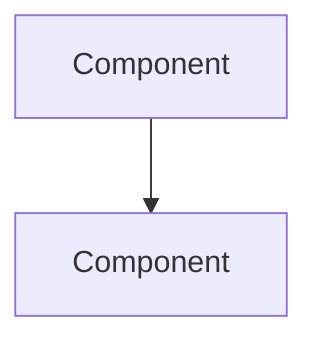

# Fumadocs Documentation Generator

Generate MDX documentation from project sources and deploy to the Fumadocs instance.

## Arguments
- `(none)` - Full: analyze project → generate MDX → deploy to Fumadocs
- `refresh` - Update existing MDX docs (selective regeneration, preserves manual edits)
- `docs-only` - Generate locally in `docs/fumadocs/`, skip deploy
- `deploy` - Skip generation, deploy existing `docs/fumadocs/` to target

## Instructions

### Phase 0: Context Gathering

1. **Query cognee** for prior analysis of the project:
   ```
   cognee.search("What do I know about <project-name>?", search_type="GRAPH_COMPLETION", top_k=5)
   ```

2. **Detect existing documentation** via Glob (run all in parallel):
   - `CLAUDE.md`, `.claude/CLAUDE.md`
   - `llms.txt`
   - `README.md`, `README.org`
   - `docs/*.rst`, `docs/conf.py`
   - `CHANGELOG.md`
   - `docs/fumadocs/` (existing MDX — determines fresh vs update)

3. **Derive project slug** from the current directory name:
   - `sesio__watchdog` → `sesio-watchdog` (replace `__` with `-`)
   - Single-word names (e.g., `althea`) → use as-is

### Phase 1: Analysis

Read project sources to build understanding. Primary sources first (parallel reads),
then fill gaps from secondary sources and infrastructure.

#### Primary Sources (existing docs)

Read all that exist, in parallel:

| Source | What it provides |
|--------|-----------------|
| `CLAUDE.md` / `.claude/CLAUDE.md` | Architecture, tech stack, file structure, design decisions |
| `llms.txt` | Concise project summary, key files, architecture overview |
| `README.md` / `README.org` | Overview, installation, usage |
| `docs/*.rst` | Sphinx narrative docs (architecture, configuration, usage) |
| `CHANGELOG.md` | Version history |

#### Secondary Sources (fill gaps from code)

Only read these if primary sources leave gaps:

| Source | What it provides |
|--------|-----------------|
| `pyproject.toml` / `package.json` / `go.mod` | Tech stack, dependencies, scripts |
| Entry points (`src/main.py`, `src/cli.py`, `cmd/`) | CLI args, commands |
| Config files / constants modules | Configuration options, defaults |
| Source code structure (Glob/Grep) | File layout, patterns, class/function discovery |

#### Infrastructure Sources

Check all applicable ecosystems (not just first match):

| Source | What it provides |
|--------|-----------------|
| `terraform/` (`main.tf`, `variables.tf`, `outputs.tf`) | AWS resources, infra architecture |
| `docker-compose.yml` / `Dockerfile` | Containerization setup |
| `buildspec*.yml`, `.github/workflows/`, `.gitlab-ci.yml` | CI/CD pipeline |
| AWS MCP (if available) | Live AWS resource discovery |
| MongoDB MCP (if available) | Database schemas, collections, indexes |
| `.awsprofile` | AWS profile/region context |

**AWS MCP tool order (mandatory if using AWS MCP):**
1. `check_environment_variables()`
2. `get_aws_session_info(env_check_result)`
3. `list_resources` / `get_resource`

If MCP credentials are unavailable, document from Terraform/buildspec files and note
that live discovery was skipped.

#### Analysis Strategy

- Read all primary sources first (parallel reads)
- Identify gaps: if existing docs cover a topic well, adapt rather than re-analyze
- For gaps (e.g., no configuration docs but config module exists), read source code
- For diagrams: convert existing ASCII art/Graphviz to Mermaid, or generate from architecture understanding
- **Sparse projects:** If no primary sources exist, warn the user that generated docs
  will be based solely on source code analysis and may need more manual editing
- **Security:** Never include secrets, connection strings, API keys, or tokens in generated MDX.
  Mask any found in config files (including `.mongoconfig`) and warn the user.
  `.awsprofile` profile names are OK, but never credentials.

### Phase 2: Generate MDX

#### Output Directory

```
docs/fumadocs/<project-slug>/
```

#### File Structure

Generate the following pages. **Adaptive:** skip pages where no relevant content exists
(e.g., no Terraform/CI/CD → skip `infrastructure.mdx`, no CHANGELOG → skip `changelog.mdx`,
no install script/systemd → skip `installation.mdx`).

| File | Content |
|------|---------|
| `meta.json` | Sidebar navigation ordering |
| `index.mdx` | Overview — what the project is, why it exists, key features |
| `architecture.mdx` | Components, data flow, Mermaid diagrams |
| `configuration.mdx` | Config options with tables (option, type, default, description) |
| `usage.mdx` | How to run, CLI commands with examples |
| `installation.mdx` | How to install/deploy on target environment |
| `infrastructure.mdx` | AWS resources, CI/CD pipeline, deployment architecture |
| `development.mdx` | Dev setup, testing, contributing |
| `changelog.mdx` | Version history |

#### MDX Frontmatter

Every `.mdx` file must start with:

```mdx
---
title: Page Title
description: One-line description of page content
---
```

#### meta.json

Generate `meta.json` with only the pages that were created:

```json
{
  "title": "Project Display Name",
  "pages": ["index", "architecture", "configuration", "usage", ...]
}
```

#### Diagrams

Use Mermaid blocks (natively supported by Fumadocs):

````mdx

````

Convert any ASCII art or Graphviz diagrams found in existing docs to Mermaid.

#### Manual Edit Markers

Initial generation does NOT emit `{/* MANUAL */}` markers. Users add these later
to protect hand-written sections during refresh:

```mdx
{/* MANUAL: START */}
Custom content — preserved on refresh.
{/* MANUAL: END */}
```

#### Content Quality

- Write for an engineer who is new to the project
- Clear headings, short paragraphs
- Code examples for CLI usage and configuration
- Tables for configuration options
- Mermaid diagrams for architecture and data flow
- No raw ASCII art — always convert to Mermaid

### Phase 3: Deploy

> **Skip if argument is `docs-only`.**

1. **Show summary** of generated files with line counts. Ask for confirmation.

2. **rsync to target:**
   ```bash
   rsync -avz --delete docs/fumadocs/<project-slug>/ \
     pve3:/mnt/nfs/fumadocs/content/docs/<project-slug>/
   ```
   - SSH host: `pve3` (PVE3 hypervisor at 192.168.1.30, hosts the NFS mount)
   - NFS path: `/mnt/nfs/fumadocs/content/docs/`
   - `--delete` cleans up removed pages on target
   - The LXC container (192.168.1.40) reads from NFS — rsync targets the hypervisor, not the container

3. **Verify deployment:**
   ```bash
   curl -sL -o /dev/null -w '%{http_code}' https://fumadocs.local.ssdd.io/docs/<project-slug>
   ```
   Expected: 200 (or 307 redirect to trailing slash)

4. **Report:** Show deployed URL and list of pages.

### Deploy-Only Mode (`/fumadocs deploy`)

1. Verify `docs/fumadocs/<project-slug>/` exists locally.
   If not, error with: "No local docs found. Run `/fumadocs` or `/fumadocs docs-only` first to generate."
2. Run Phase 3 deploy steps (rsync, verify, report).
3. Skip all analysis and generation.

### Refresh Mode (`/fumadocs refresh`)

#### Step 1: Capture Anchor and Pull

1. Verify local `docs/fumadocs/<project-slug>/` is git-clean.
   If uncommitted changes exist, warn and abort.
2. Capture last generation time from mtime of `docs/fumadocs/<project-slug>/meta.json`
   **before** the rsync pull (rsync overwrites mtimes).
3. rsync **from** target to local:
   ```bash
   rsync -avz pve3:/mnt/nfs/fumadocs/content/docs/<project-slug>/ \
     docs/fumadocs/<project-slug>/
   ```

#### Step 2: Detect Changes

- Use `git log --since=<captured-mtime>` to find project files changed since last generation
- Cross-check against actual file contents (catches rebases/squashes)
- Categorize changes by affected page:
  - Source code changes → `architecture.mdx`, `usage.mdx`
  - Terraform/CI changes → `infrastructure.mdx`
  - Config changes → `configuration.mdx`
  - Changelog updates → `changelog.mdx`

#### Step 3: Selective Regeneration

- Only regenerate pages whose source material changed
- Preserve content within manual edit markers:
  ```mdx
  {/* MANUAL: START */}
  This content is preserved during refresh.
  {/* MANUAL: END */}
  ```
- For pages with markers: extract manual sections, regenerate auto content, re-insert manual sections

#### Step 4: Review and Deploy

- Show diff of what changed before deploying
- Ask for confirmation
- Deploy via Phase 3 steps (rsync, verify, report)

## Post-Actions

1. **Save to cognee:**
   ```
   cognee.save_interaction:
   [project: <name>] [type: documentation]
   Decision/Finding: Fumadocs documentation generated and deployed
   Context: /fumadocs skill run
   Pages generated: <list>
   URL: https://fumadocs.local.ssdd.io/docs/<project-slug>
   ```

2. **Offer to commit:** Ask user if they want to run `/commit` for the `docs/fumadocs/` files.

3. **Report URL:** `https://fumadocs.local.ssdd.io/docs/<project-slug>`

## Fumadocs Instance Reference

| Property | Value |
|----------|-------|
| URL | `https://fumadocs.local.ssdd.io/` |
| LXC | CT 121 on PVE3 (192.168.1.40) |
| Content path (NFS) | `/mnt/nfs/fumadocs/content/docs/` (on PVE3) |
| Content path (container) | `/app/content/docs/` |
| SSH host | `pve3` (192.168.1.30) |
| NFS source | PVE ZFS dataset `data/fumadocs` |
| Runtime | Docker Compose, node:22-slim, pnpm |
| Template | fumadocs-ui-template (default config) |

## URL Structure

Projects are organized flat under `/docs/`:
- `content/docs/sesio-watchdog/index.mdx` → `https://fumadocs.local.ssdd.io/docs/sesio-watchdog`
- `content/docs/sesio-watchdog/architecture.mdx` → `https://fumadocs.local.ssdd.io/docs/sesio-watchdog/architecture`

## Notes
- Respect .gitignore — don't document ignored files
- If AWS MCP is unavailable, fall back to Terraform file analysis
- For monorepos, ask the user which service to document
- All generated content goes to `docs/fumadocs/<project-slug>/` — never modify project source files
