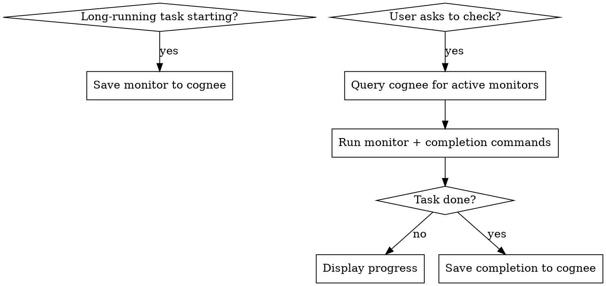

# Monitor Tasks

Track and check long-running background tasks using cognee as persistent memory.

## When to Use

- Starting a long-running task (rsync, build, deploy, migration, download)
- User says "check", "progress", "status", "how's it going"
- Resuming a session where tasks may still be running

## Core Pattern

### On Task Start: Save Monitor to Cognee

When you launch a long-running task, immediately call `save_interaction` with this format:

```
[task-monitor] [project: <name>] [status: active]
Task: <human-readable description>
Host: <hostname> (<ip or connection method>)
Monitor command: <exact command to check progress>
Parse: <what to extract from output and how to display it>
Completion signal: <how to know it's done>
Frequency: <none | Nmin | on-demand>
Started: <timestamp>
```

Example:
```
[task-monitor] [project: proxmox] [status: active]
Task: rsync consolidated data from data8tb to serenis
Host: pve (sshpass -f /tmp/.pve_pass ssh pve)
Monitor command: grep "(xfr#" /root/merge.log | tail -1
Parse: Extract xfr#N and ir-chk=M/T for file progress, speed from MB/s value
Completion signal: No rsync process running (ps aux | grep rsync | grep -v grep returns empty)
Frequency: 10min
Started: 2026-02-24 11:07
```

### On Check: Query and Execute

1. Search cognee: `"task-monitor active"` with `GRAPH_COMPLETION`
2. Run the saved monitor command
3. Run the completion signal check
4. Display in consistent format:

```
## Task: <description>
**Progress:** N/T files (X%)
**Speed:** Y MB/s
**Status:** running | completed | failed
```

### Scheduled Checks

When a task has a `Frequency` set (e.g., `10min`), check on every user interaction if enough time has elapsed since the last check. Display timing info:

```
## Task: <description>
**Progress:** N/T files (X%)
**Speed:** Y MB/s
**ETA:** HH:MM (based on rate of progress between checks)
**Status:** running | completed | failed
**Checked:** HH:MM (Nmin since last)
```

**ETA calculation:** Track files completed between checks and time elapsed. Extrapolate remaining time from that rate: `(remaining_files / files_per_minute)`. Update ETA each check — it will become more accurate over time. If rate varies wildly, show a range.

**Limitation:** Claude Code cannot push notifications. Frequency is best-effort — checks happen on the next user interaction after the interval elapses. Be transparent about this: don't promise exact timing.

### On Completion: Update Cognee

When task finishes, save:
```
[task-monitor] [project: <name>] [status: completed]
Task: <description>
Completed: <timestamp>
Result: <summary — success/failure, final stats>
```

## Decision Flow



## What Counts as Long-Running

Any task that:
- Runs in tmux, background, or on a remote host
- Takes more than 2 minutes
- User will likely ask about later

Examples: rsync, apt upgrades, builds from source, large downloads, database migrations, terraform applies.

## Common Mistakes

| Mistake | Fix |
|---------|-----|
| Saving vague monitor command | Save the **exact** command, including SSH prefix and paths |
| Forgetting connection context | Include how to reach the host (SSH command, password file, etc.) |
| Not checking completion signal | Always check if process is still running before parsing logs |
| Inconsistent display format | Use the standard progress format every time |
| Not updating cognee on completion | Mark tasks completed so future sessions don't re-check |
| Using remote host time for "Checked" | Always use **local workstation time** (`date '+%H:%M'`) — remote clocks may differ |
